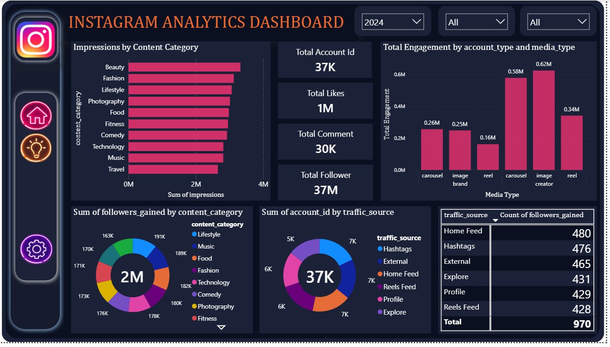

## Instagram-analytic-dashboard
This project presents an interactive Power BI dashboard built using Instagram Analytics data for the years 2024 and 2025. The dashboard provides insights into follower growth, impressions, engagement, traffic sources, and content performance.

## Dashboard Preview

## Tools Used
- Power BI
- Microsoft Excel
- DAX
- Power Query

## Dataset
- Instagram Analytics Dataset (2024–2025)

## Dashboard Features
- KPI Cards
- Followers Analysis
- Content Category Analysis
- Traffic Source Analysis
- Impressions Analysis
- Interactive Filters

## Files
- Instagram_Analytics.csv
- Instagram_Analytics_Dashboard.pbix 
- Dashboard Screenshots

## Added report 
- report of the instagram analytics dashboard to understand the insights and also uploaded the business recommendation for the instagram

## Author
**Harmandeep Kaur**
